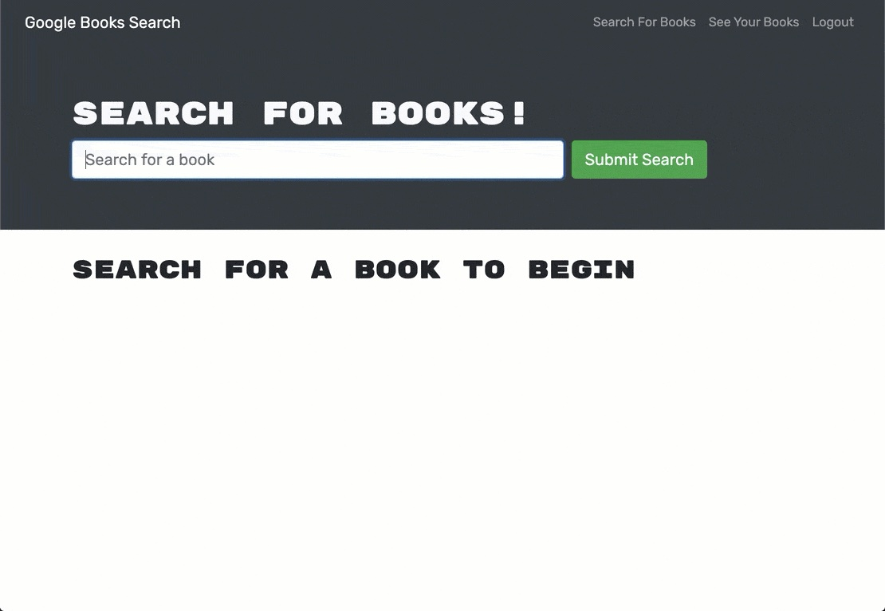
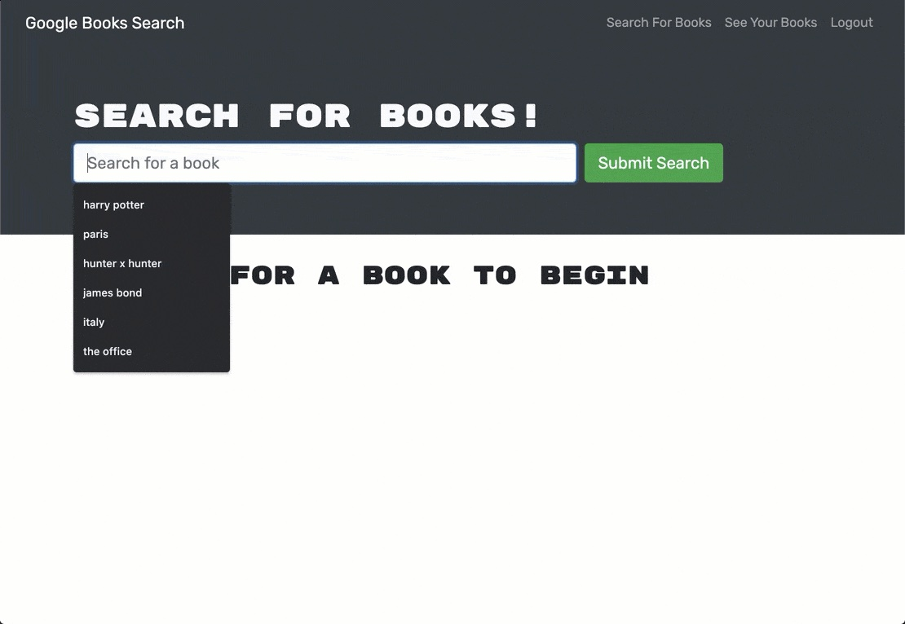
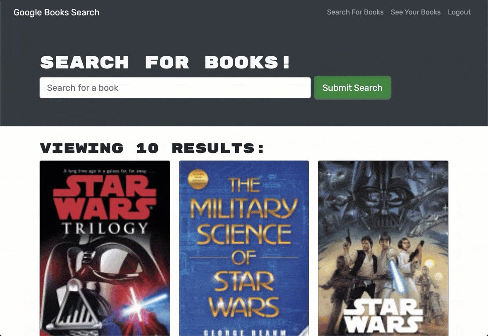

# Google Books API Search Engine 

## Description
This Google Book Search Engine is a fully functioning full-stack MERN application with both client and server side. This app was built with a RESTful API and my task was to refactor it to be a GraphQL API built with Apollo Server. 

## Table of Contents
* [Technologies](#technologies)
* [Screenshots](#screenshots)
* [Links](#links)

## Technologies
  
  
  
  
  
  
  
   
  

## Screenshots
#### Homepage Logged In

#### Homepage Search for Book

#### Homepage Books Returned from Search

## Links
* [Book Search Heroku Deployed App](https://protected-beyond-33559.herokuapp.com/)
* [Book Search GitHub Repository](https://github.com/bspiewak6/booksearch)

## License
  
This app is licensed under the MIT license.